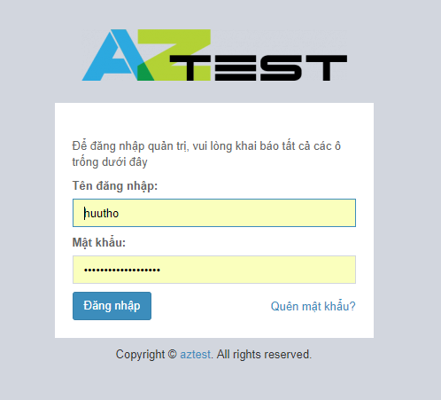
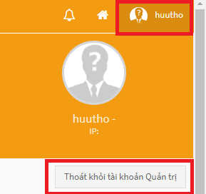

## Khởi tạo website

Bạn có thể khởi tạo website qua các liên kết sau đây

- Đăng ký gói dùng thử, sau 15 ngày hệ thống tự động chuyển sang gói miễn phí nếu bạn không có động thái chuyển đổi gói dịch vụ [https://aztest.vn/site/register/](https://aztest.vn/site/register/)
- Lựa chọn gói đăng ký [https://aztest.vn/bang-so-sanh-tinh-nang.html](https://aztest.vn/bang-so-sanh-tinh-nang.html)

Tiến hành khai báo thông tin vào biểu mẫu, thông tin của bạn cần được bộ phận quản lý nội dung của [AZtest](https://aztest.vn) kiểm duyệt. Thông tin đăng nhập quản trị website sẽ được gửi về mail sau khi yêu cầu của bạn được chấp nhận.

## Đăng nhập khu vực quản trị

Sau khi tiến hành đăng ký khởi tạo thành công, hệ thống AZtest xét duyệt và gửi email thông báo về cho bạn như hình dưới đây.

Tiến hành vào website mà bạn đăng ký để đăng nhập.
lưu ý: để đăng nhập vào khu vực quản trị chúng ta điền tên miền + admin ( ví dụ : http://huutho.aztest.vn/admin/ ).Điền thông tin mà email hệ thống AZtest đã gửi về để đăng nhập.

Sau đó chọn khu vực quản lý site để vào khu vực quản trị.

Và đây là khu vực quản trị của bạn.

## Đăng xuất khu vực quản trị
Để đăng xuất khu vực quản trị, chúng
 ta chọn tài khoản và thoát khỏi tài khoản quản trị.
	
## Thay đổi thông tin tài khoản
Để thay đổi thông tin tài khoản	bạn vào mục tài khoản và chọn sửa. 
 
Điền các thông tin cần thay đổi và bấm lưu.

## Chuyển đổi gói dịch vụ

Nếu có nhu cầu chuyển đổi gói dịch vụ , bạn vui lòng liện hệ với bộ phận AZtest để đội ngũ Atest hỗ trợ kịp thời và sớm nhất cho bạn.

## Các câu hỏi thường gặp
**Tôi có thể yêu cầu thêm các tính năng ở website của tôi không ?**

AZtest sẵn sàng mở rộng tính năng áp dụng cho từng website cụ thể trong cùng hệ thống. Để làm phong phú hơn website của bạn, bạn có thể yêu cầu AZtest lập trình thêm tính năng. Nếu là tính năng mang tính cá nhân, bạn sẽ phải trả một khoản phí cho việc xây dựng tính năng đó, ngược lại nếu tính năng mang tính cộng đồng (ai cũng có nhu cầu) thì AZtest sẽ bổ sung cho hệ thống của chúng ta hay hơn mà bạn không cần một khoản phí nào.

Bạn có thể liên hệ với AZtest hoặc đưa ý tưởng lên các kênh thảo luận.

**Tôi có thể dụng tên miền riêng cho website của tôi không ?**

Nếu đã có tên miền, vui lòng trỏ tên miền về IP 61.14.235.164, sau đó liên hệ với chúng tôi đễ được hỗ trợ chuyển đổi tên miền.
Trường hợp bạn chưa có tên miền, muốn mua tên miền mới, chúng tôi sẵn sàng cung cấp và hỗ trợ cấu hình tên miền mới cho website của bạn. Liên hệ để được tư vấn về giá.

**Tôi thấy website khá hay, rất hiệu quả cho vấn đề giáo dục hiện nay và tôi muốn dùng ở các kỳ thi tập trung không ? **

AZtest không được thiết kế để làm việc này. Hệ thống AZtestPro của chúng tôi có thể đáp ứng được nhu cầu của bạn, bạn xem giới thiệu chi tiết hơn tại AZtestPro - Hệ thống tổ chức thi trắc nghiệm tập trung

Vui lòng liên hệ với chúng tôi để được tư vấn chi tiết:

CÔNG TY TNHH PHÁT TRIỂN VÀ DỊCH VỤ NGUỒN MỞ THUẬN ĐỨC
Điện thoại: 02336 270 610
Hotline: 0905 908 430 (hỗ trợ 24/7)
Email: contact@tdfoss.vn

