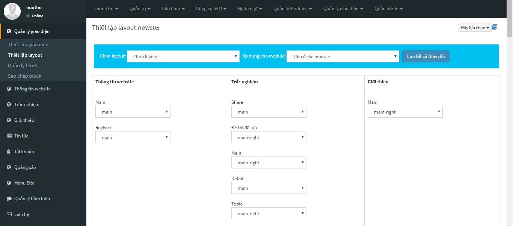

## Cấu hình thông tin website
Để cấu hình thông tin website bạn đăng nhập vào quản trị website sau đó vào mục cấu hình và chọn "Cấu hình site". 

Trong mục cấu hình site chúng ta có thể cấu hình các phần như tên miền, tên gọi của website và ảnh của website ... 

Sau khi cấu hình xong chúng ta chọn "Lưu cấu hình" để lưu cấu hình cài đặt.

## Cấu hình máy chủ gửi thư (Email)

Cấu hình email gửi thư chúng ta cần vào "Cấu hình site" và chọn "Cấu hình SMTP", chọn giao thức SMPT và điền các thông số như hình hướng dẫn rồi lưu lại.

## Quản lý module
Trong hệ thống quản lý website có rất nhiều module và để quản lý được cái module người dùng chọn menu "Quản lý module". Mục quản lý module giúp người dùng quản lý từng module nhỏ trong hệ thống website.

## Quản lý giao diện người dùng

Để quản lý giao diện website , người dùng vào mục "Quản lý giao diện" trên thanh menu để hiểu chỉnh website.

## Quản lý nhóm thành viên

Để quản lý hệ nhóm thành viên người dùng chọn "Tài khoản và chọn nhóm thành viên", ở mục nhóm thành viên người dùng có thể quản lý tất cả các nhóm thành viên bằng các phân quyền có sẵn như tạo nhóm thành viên, thêm, sửa, xóa tài khoản thành viên và nhiều phần quyền khác. Các nhóm thành viên đều có hiệu lực riêng tùy vào người sử dụng phân quyền.

 

### Thêm nhóm

Để thêm nhóm thành viên người dùng chọn thêm nhóm, điền tất cả thông tin về nhóm như tên nhóm, mô tả và các phân quyền của nhóm mà người dùng cho phép.

### Sửa thông tin nhóm

Để sửa thông tin nhóm người dùng chọn nhóm thành viên và chọn chế độ sửa , điền những thông tin muốn sửa và lưu những thông tin cần sửa cho phù hợp.

(Lưu ý: chỉ những nhóm thành viên nào được cho phép phân quyền sửa mới được sửa).

### Xóa nhóm
Tương tự chức năng sửa nhóm người dùng chọn nhóm cần xóa và tiến hành thao tác xóa.

(Lưu ý: chỉ những nhóm thành viên nào được cho phép phân quyền xóa mới được xóa).

## Quản lý tài khoản thành viên

Để quản lý tài khoản thành viên người dùng chọn mục tài khoản.

### Thêm tài khoản

Thêm tài khoản người dùng cần chọn vào mục thêm tài khoản mới, điền đầy đủ thông tin tài khoản và lưu tài khoản cần thêm.

### Sửa thông tin tài khoản

Để sửa thông tin tài khoản người dùng chọn tài khoản cần sửa và chọn sửa, sau khi điền thông tin cần sửa người dùng bấm lưu để lưu thông tin cần chĩnh sửa.

### Xóa tài khoản

Nếu mọi người muốn xóa tài khoản của một thành viên nào muốn xóa và chọn xóa.

### Thêm trường thông tin thành viên

Để thêm trường thông tin thành viên người dùng cần chọn "Tùy biến dữ liệu" trong mục tài khoản.

Điền trường dữ liệu cần thêm và bấm lưu, trường dữ liệu người dùng thêm vào sẽ được hiển thị khi thêm nhân viên và ở bảng trường thông tin thành viên.

### Nhập danh sách thành viên từ Excel

Để nhập danh sách thành viên từ file Excal, người dùng chọn "Nhập từ Excal" có trong mục tài khoản.

Chọn tệp có chưa thông tin thành viên và bắt đầu kiểm tra, sau khi kiểm tra thành công người dùng sẽ tới bước cấu hình các tài khoản vừa được nhập vào. và cuối cùng là thực hiện lưu lạ danh sách các thành viên cần nhập vào.
## Bổ nhiệm người quản trị

Để bổ nhiệm một thành viên làm người quản trị, người dùng cần chọn tài khoản cần bổ nhiệm sau đó tích vào ô "Là tài khoản của nhóm" và chọn nhóm mà người dùng muốn bổ nhiệm.

